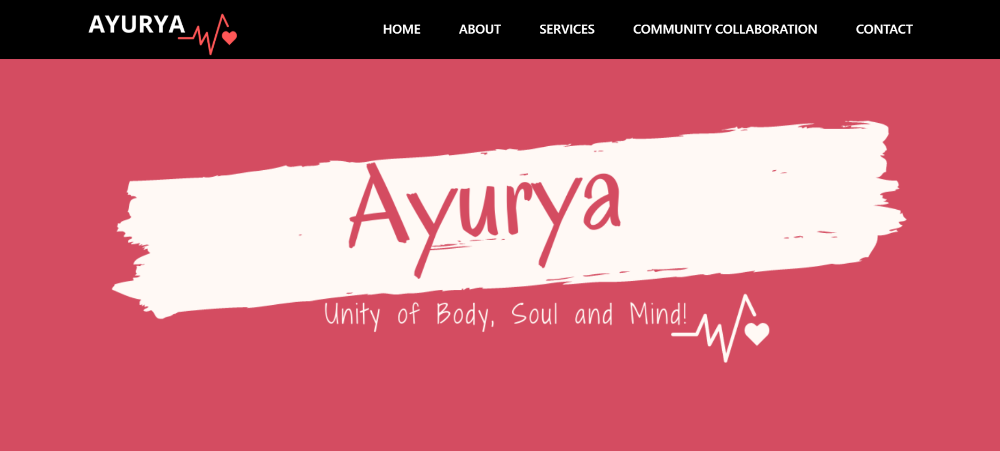
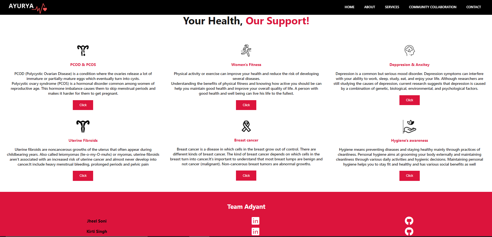

# Team Adyant
* Kirti
* Jheel

## Problem Statement
Women experience unique health issues and conditions, like Polycystic Ovarian Disease(PCOD), Polycystic Ovarian Syndrome (PCOS), Breast Cancer, uterine fibroids, and Depression & Anxiety. 
    “810 Women approximately, die everyday from preventable causes         
             that remain undiagnosed" 
    "311 000 Women died in 2018 from cervical cancer”
    “No access to menstrual hygiene is the fifth biggest killer of women
     in the world ”-India Today
Many times women’s health conditions go undiagnosed and most drug trials do not include female test subjects. Depression and anxiety exhibit more frequently among female patients. She also neglects her fitness. 
Most women neglect or feel hesitant to visit Gynecologist and this reluctance results in hazardous results.

## Solution

The need of the hour is to adopt the easiest strategy of prevention. Prevention means an early diagnosis and a timely and effective treatment. We have developed a website “NIROGYA”. The initiative of this website is to provide gynecological healthcare facilities and resolving fitness & mental health issues for every woman. Our main motto is to make every woman healthy whether physically or mentally. We focus on female health issues that are neglected most of the time.women are the future fundamental of every country. Our target audience consists of women of all ages.

## Working

We help them with an analysis part through which a woman can easily diagnose her health issues like PCOD/PCOS, Breast cancer, Uterine fibroids on her own and she can even have an appointment with a gynecologist, free of cost.
As mentioned before women have more chances of anxiety and depression, we will be solving it with the help of CBT therapy, one-to-one conversation with Therapist.
As for good fitness, a woman needs a proper diet and exercise so, she can easily find out her body type and can follow a suitable diet chart according to it. We came up with the idea of having one-to-one fitness training.
With the help of our website, we make women aware of their Hygiene importance. By conducting different awareness campaigns, programs, and events in different localities. We also focus on community building ans collobration.

